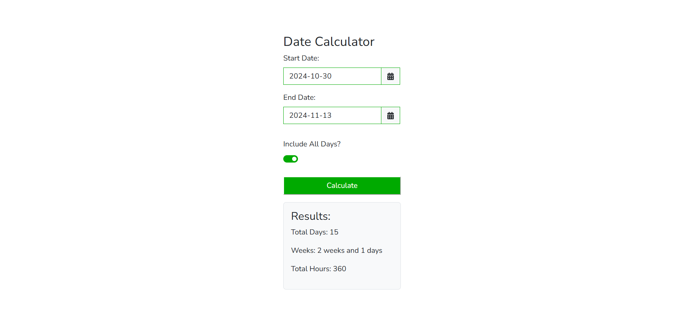

 ## Available Scripts

In the project directory, you can run:

### `npm run dev`

Builds the app for production to the `build` folder.\
It correctly bundles React in production mode and optimizes the build for the best performance.

The build is minified and the filenames include the hashes.\
Your app is ready to be deployed!

### `npm run build` / 'vite build'

"scripts": {
"dev": "vite",
"build": "vite build",
"lint": "eslint .",
"preview": "vite preview"
},

#### ouput https://arborgold-calculators.netlify.app/

